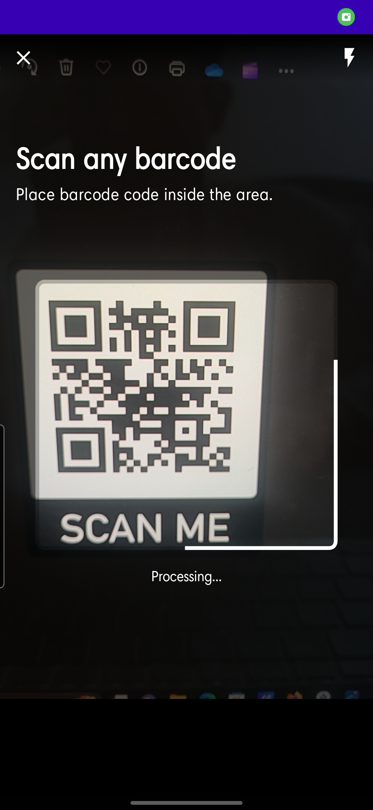
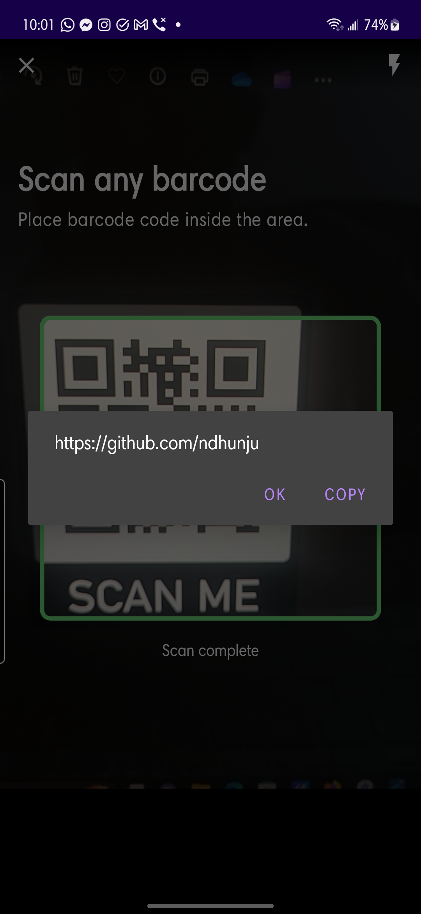

# Barcode (and QR code) Scanner

Light weight Android library that allows android app to add barcode and QR code scanning abilities.

### Screens
Scroll horizontally to see more ➡️

<table>
  <tr>
    <th>Processing Screen</th>
    <th>Scan Complete Screen</th>
  </tr>
  <tr>
    <td></td>
    <td></td>
  </tr>
  <tr>
    <td width="256">
Processing Demo
</td>
    <td width="256">
Scan Complete Demo
</td>
  </tr>
</table>