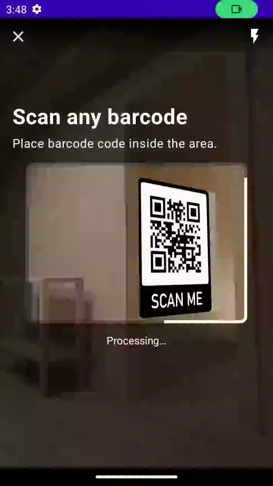

# Barcode (and QR code) Scanner - Android Library

This is a light weight Android library that provides barcode and QR code scanning capabilities along
with out-of-the-box UI.

### Sample Android App?
See [BarcodeScannerApp](https://github.com/ndhunju/BarcodeScanner/tree/master/BarcodeScannerApp)

### How to add this library to your android app?
See https://jitpack.io/#ndhunju/BarcodeScanner

### Screens
Scroll horizontally to see more ➡️

<table>
  <tr>
    <th width="256">Scanning State</th>
    <th width="256">Scan Complete State</th>
  </tr>
  <tr>
    <td></td>
    <td></td>
  </tr>
  <tr>
    <td>
Demo of the app actively scanning for barcode
</td>
    <td>
Demo of the app when scanning is complete.
</td>
  </tr>
</table>